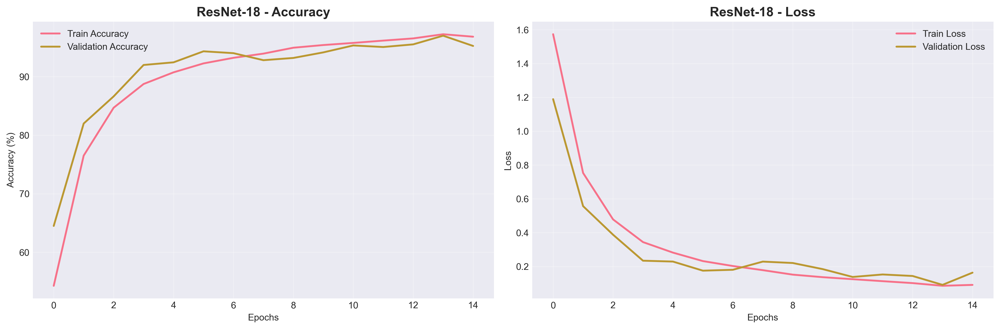
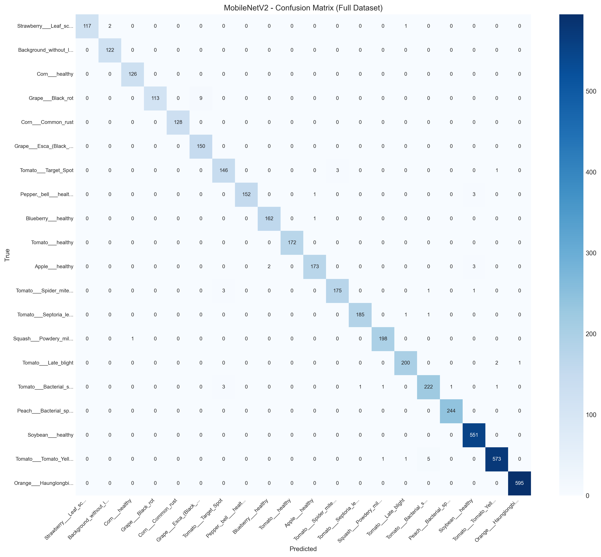
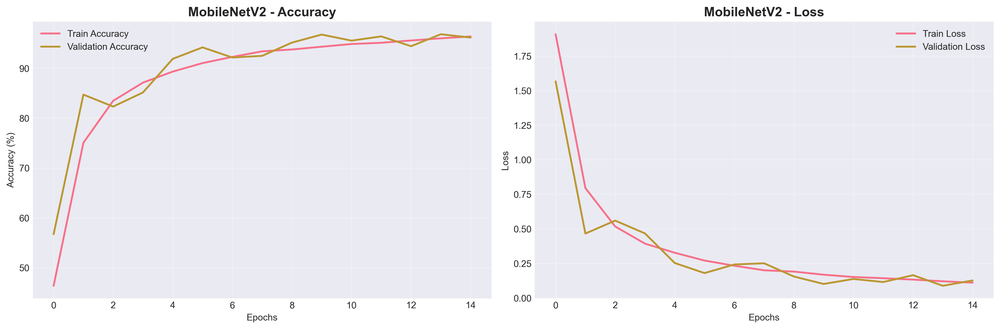

# 🌿 Plant Disease Classification using Deep Learning

<p align="center">
  
  
  
  
</p>

---

## 📌 Overview

This project presents a **comprehensive deep learning pipeline** for plant disease classification using the **PlantVillage dataset**.

We implement and compare multiple CNN architectures:

* AlexNet
* ResNet-18
* MobileNetV2
* ResNet50 (Transfer Learning)

The project includes:

* Data preprocessing & balancing
* Model training and evaluation
* Per-class performance analysis
* Feature visualization (t-SNE)
* Comparative study across architectures

---

## 🧠 Key Contributions

✔ End-to-end ML pipeline (data → training → evaluation)
✔ Multi-model comparison (efficiency vs accuracy trade-offs)
✔ Detailed **per-class failure analysis**
✔ Transfer learning limitations identified
✔ Reproducible experimental setup

---

## 📊 Results Summary

| Model         | Accuracy   | Params | Best F1 | Worst F1   |
| ------------- | ---------- | ------ | ------- | ---------- |
| MobileNetV2   | **97.23%** | 2.27M  | 1.0000  | 0.5714     |
| ResNet-18     | 97.15%     | 11.2M  | 1.0000  | 0.8571     |
| ResNet50 (TL) | 96.58%     | 24.7M  | 1.0000  | **0.0000** |
| AlexNet       | 89.86%     | 58.4M  | 0.9960  | 0.6316     |

---

## 📉 Training Visualization

### 🔹 ResNet-18 Training Curve



### 🔹 MobileNetV2 Training Curve


---

## 📊 Confusion Matrices

### 🔹 ResNet-18


### 🔹 MobileNetV2



---

## 🔬 Feature Space Visualization (t-SNE)

### 🔹 ResNet-18 Embeddings



---

## ⚠️ Important Finding

> Transfer learning **completely failed** on:
>
> **Potato___healthy → F1 = 0.0000**

### 📌 Interpretation:

* ImageNet features do not generalize well to this class
* Domain mismatch impacts performance
* From-scratch training is more reliable here

---

## 🏆 Model Insights

### 🥇 MobileNetV2 (Best Overall)

* Highest accuracy
* Extremely lightweight (2.27M params)
* Ideal for mobile deployment

### 🥈 ResNet-18 (Most Stable)

* Consistent across all classes
* No catastrophic failures
* Best for research use

### ⚠️ ResNet50 (Transfer Learning)

* Improved average metrics
* But failed on specific classes
* Not reliable alone

---

## 📁 Project Structure

```
.
├── data/
├── preprocessing.py
├── a_alexnet_pytorch.py
├── ab_resnet18_pytorch.py
├── ac_mobilenetv2_pytorch.py
├── ada_resnet50_tl.py
├── results/
├── figures/
└── README.md
```

---

## ⚙️ Installation

```bash
git clone https://github.com/adnanphp/plant-disease-classification.git
cd plant-disease-classification
pip install -r requirements.txt
```

---

## ▶️ Usage

### Step 1 — Preprocess Data

```bash
python preprocessing.py
```

### Step 2 — Train Models

```bash
python ab_resnet18_pytorch.py
python ac_mobilenetv2_pytorch.py
```

### Step 3 — Transfer Learning

```bash
python ada_resnet50_tl_finetune.py
```

---

## 🎥 Demo (Optional)

> Add a demo GIF here (highly recommended)

Example:

```

```

---

## 📦 Dataset

* PlantVillage Dataset (~55K images, 39 classes)
* Balanced to ~40K samples

---

## 📚 References

* Hughes & Salathé (2015) — PlantVillage
* He et al. (2016) — ResNet
* Sandler et al. (2018) — MobileNetV2

---

## 👤 Author

**Adnan**
GitHub: https://github.com/adnanphp

---

## ⭐ Support

If you find this project useful:
👉 Star this repository

---

## 🚀 Future Work

* Vision Transformers (ViT)
* Domain adaptation techniques
* Real-time mobile deployment
* Dataset augmentation for rare classes
